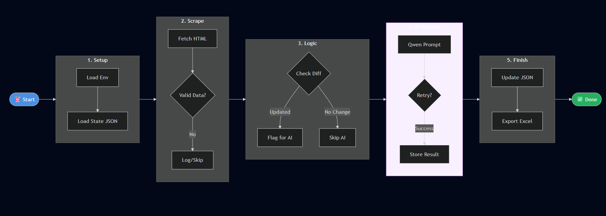

# 🔄 Automated Documentation Gap Analysis System

> **An automation workflow that scrapes help articles, detects changes, and performs AI-powered gap analysis every 12 hours.**

---

## 📊 System Architecture Flowchart

---

## 🔍 Workflow Walkthrough

### **Stage 1: Initialization & Environment Setup** 🚀

The workflow begins when the **scheduler triggers `automation.py` every 12 hours**. The system performs critical initialization:

- **Environment Validation**: Verifies all dependencies (pandas, huggingface_hub, scraper module) are available
- **State Recovery**: Attempts to load `articles_state.json` containing previous scrape results
  - If found → loads existing state for comparison
  - If missing → initializes empty state and logs a warning

**Error Handling**: Missing dependencies or critical initialization failures terminate the workflow immediately with detailed error logs.

---

### **Stage 2: Web Scraping & Data Extraction** 🌐

The scraper module (`scraper.py`) is initialized and begins fetching articles:

- **Article Discovery**: Scrapes all articles from the help center
- **HTML Parsing**: Extracts structured data from each article page
- **Metadata Extraction**: Captures comprehensive article information:
  - Article ID, Title, Category, URL
  - Last Updated timestamp (critical for change detection)
  - Content Type, Keywords, Word Count
  - Screenshot presence detection

**Validation**: Each article undergoes validation. Invalid or malformed data is logged and skipped to prevent downstream failures.

---

### **Stage 3: Change Detection & Comparison** 🔄

The system performs intelligent differential analysis:

- **New Article Detection**: Identifies articles not present in previous state
- **Update Detection**: Compares `Last Updated` timestamps to detect modifications
- **Status Classification**: Articles are marked as:
  - `NEW` → Never seen before
  - `UPDATED` → Timestamp changed since last run
  - `UNCHANGED` → No modifications detected

**Optimization**: Unchanged articles skip AI analysis and reuse previous gap data, saving API calls and processing time.

---

### **Stage 4: AI-Powered Gap Analysis** 🤖

For new or updated articles, the system performs advanced AI analysis:

- **AI Client Initialization**: Connects to HuggingFace Inference API using the `Qwen/Qwen2.5-7B-Instruct` model
- **Prompt Engineering**: Constructs specialized prompts requesting:
  - Identification of **one high-impact documentation gap**
  - Focus on advanced, non-obvious topics
  - Practical depth, edge cases, scalability concerns
  
**Intelligent Retry Logic**:
- **Rate Limit Handling (429/503)**: Implements exponential backoff (20s × attempt number)
- **Maximum 3 Retry Attempts**: Prevents infinite loops
- **Graceful Degradation**: Falls back to "Analysis Failed" or "Rate Limit Exceeded" messages

**Rate Limiting Protection**: 2-second delay between AI calls prevents overwhelming the API.

---

### **Stage 5: Data Persistence & Export** 💾

After processing all articles, the system persists results:

- **State Serialization**: Saves complete article data to `articles_state.json` (enables future comparisons)
- **DataFrame Construction**: Builds structured pandas DataFrame with ordered columns:
  - Article ID, Title, Category, URL, Last Updated
  - Content Type, Keywords, Word Count, Has Screenshots
  - **Gaps Identified** (AI-generated analysis)
- **Excel Export**: Generates `Articles.xlsx` for human review and reporting

**Validation**: DataFrame construction and Excel export are validated with error handling to ensure data integrity.

---

### **Stage 6: Logging & Monitoring** 📊

Throughout execution, the system provides comprehensive logging:

- **[SUCCESS]** → Successful operations (state loaded, AI analysis complete, export successful)
- **[WARNING]** → Non-critical issues (no previous state, API rate limits)
- **[ERROR]** → Critical failures (dependency missing, API errors, export failures)

**End States**:
- **SUCCESS**: Workflow completes with updates saved or no changes detected
- **FAILURE**: Critical error encountered, logged with context for debugging

---

## 🎯 Key Features

| Feature | Description |
|---------|-------------|
| **Automated Scheduling** | Runs every 12 hours without manual intervention |
| **Intelligent Change Detection** | Only processes new/updated articles |
| **AI-Powered Analysis** | Uses advanced LLM for gap identification |
| **Robust Error Handling** | Graceful degradation with retry logic |
| **Comprehensive Logging** | Color-coded status indicators for monitoring |
| **Data Persistence** | State management enables incremental processing |
---

## 🔧 Technical Stack

- **Language**: Python 3.x
- **Web Scraping**: Custom scraper module (BeautifulSoup/Selenium assumed)
- **AI Model**: Qwen/Qwen2.5-7B-Instruct via HuggingFace Inference API
- **Data Processing**: pandas
- **State Management**: JSON serialization
- **Export Format**: Excel (.xlsx)

---

## 📈 Performance Considerations

- **Incremental Processing**: Only analyzes changed articles (reduces API costs)
- **Rate Limit Protection**: 2s delays + exponential backoff prevents API throttling
- **Graceful Degradation**: Continues processing even if individual articles fail
- **State Recovery**: Resumes from last known state if interrupted